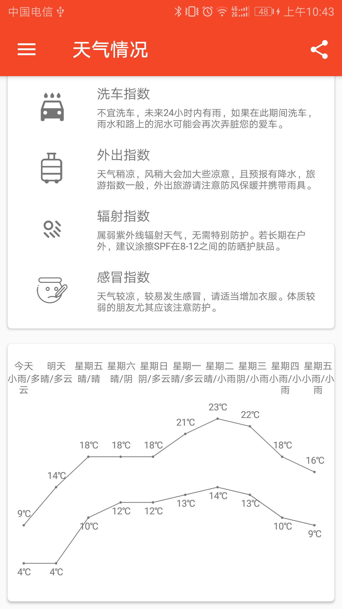
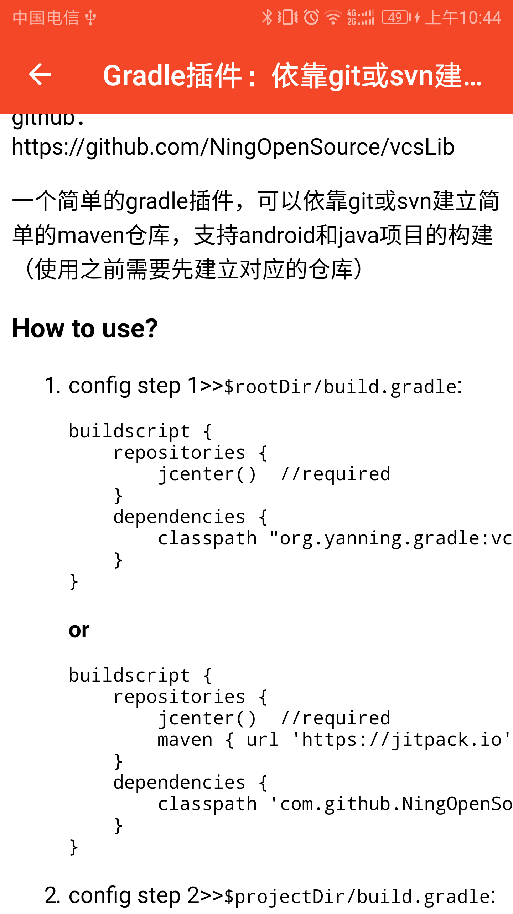
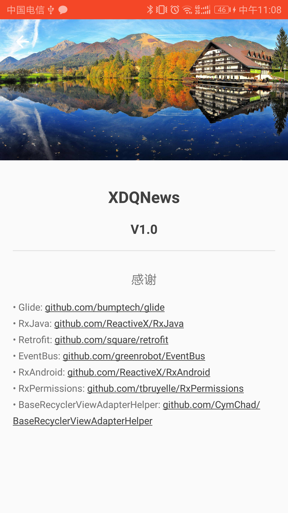

#### XDQNews

  一款简单的天气信息+泡在网上的日子新闻+图片浏览的App。
  拥有数以百万计的图片资源，来自 http://gank.io 和 http://image.baidu.com

#### 功能介绍

  app主要功能有：
  1. 天气信息查看，数据来源于 http://tj.nineton.cn 中央天气预报
  2. 泡在网上的日子新闻 数据来源于 http://www.jcodecraeer.com 
  3. 图片资源 数据来源于 http://gank.io 和 http://image.baidu.com
#### 截图
  
  
  
  
  
  
  
  
  
  
  
#### About me
An android developer in WuHan

#### Thanks
    butterknife:https://github.com/JakeWharton/butterknife
    eventbus:https://github.com/greenrobot/EventBus
    rxjava:https://github.com/ReactiveX/RxJava
    retrofit:https://github.com/square/retrofit
    BaseRecyclerViewAdapterHelper:https://github.com/CymChad/BaseRecyclerViewAdapterHelper
    glide:https://github.com/bumptech/glide
    jsoup:https://github.com/jhy/jsoup

