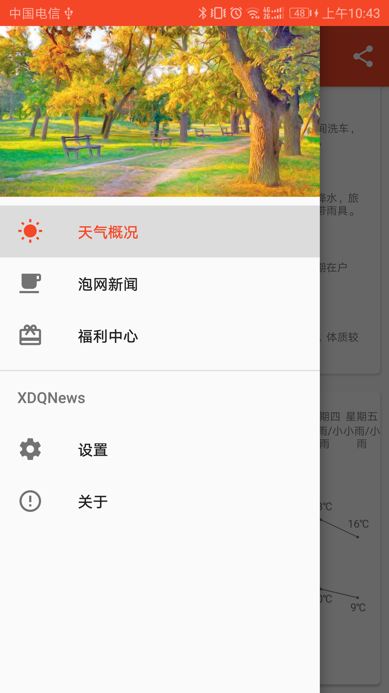

#### XDQNews

  一款简单的天气信息+泡在网上的日子新闻+图片浏览的App。
  拥有数以百万计的图片资源，来自 http://gank.io 和 http://image.baidu.com

#### 功能介绍

  app主要功能有：
  1. 天气信息查看，数据来源于 http://tj.nineton.cn 中央天气预报
  2. 泡在网上的日子新闻 数据来源于 http://www.jcodecraeer.com 
  3. 图片资源 数据来源于 http://gank.io 和 http://image.baidu.com
#### 截图
  <a href="art/1.png"></a>
  <a href="art/2.png"></a>
  <a href="art/3.png"></a>
  <a href="art/4.png"></a>
  <a href="art/5.png"></a>
  <a href="art/6.png"></a>
  <a href="art/7.png"></a>
  <a href="art/8.png"></a>
  <a href="art/9.png"></a>
  <a href="art/10.png"></a>
  <a href="art/11.png"></a>
#### About me
An android developer in WuHan

#### Thanks
  引入：
  ```
    compile 'org.greenrobot:eventbus:3.1.1'
    compile 'io.reactivex.rxjava2:rxandroid:2.0.1'
    compile 'io.reactivex.rxjava2:rxjava:2.1.7'
    compile 'com.trello.rxlifecycle2:rxlifecycle:2.2.1'
    compile 'com.trello.rxlifecycle2:rxlifecycle-components:2.2.1
    compile 'com.squareup.retrofit2:retrofit:2.3.0'
    compile 'com.squareup.retrofit2:converter-gson:2.3.0 
    compile 'com.squareup.retrofit2:converter-scalars:2.3.0' 
    compile 'com.squareup.retrofit2:adapter-rxjava2:2.3.0 
    compile 'com.squareup.okhttp3:logging-interceptor:3.9.1'
    compile 'com.github.CymChad:BaseRecyclerViewAdapterHelper:2.9.35'
    implementation 'com.github.bumptech.glide:glide:4.6.1'
    annotationProcessor 'com.github.bumptech.glide:compiler:4.6.1'
    implementation 'com.afollestad.material-dialogs:core:0.9.6.0'
    implementation 'com.afollestad.material-dialogs:commons:0.9.6.0'
    compile 'org.jsoup:jsoup:1.10.1'
  ```

